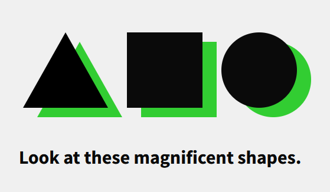

# Magnificent shapes

This is my entry point into making shapes with CSS, I was interested.

## Overview



## Inspect

There is no point in publishing this to GitHub Pages, so if you want to inspect these, you can:

```bash
# Clone the repo
gh repo clone MartinHeywang/magnificent-shapes

# Serve the folder
cd magnificent-shapes
serve -s .
```
